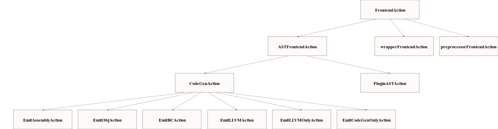

## report on LLVM

### some of c++11/c++14 features used in llvm

* final keyword : this keyword is used after class name so that we cannot inherit that class   
reference : https://github.com/llvm/llvm-project/blob/main/clang/include/clang/Lex/MacroArgs.h  
* explicit keyword   
reference : https://github.com/llvm/llvm-project/blob/main/clang/include/clang/Lex/MacroInfo.h    
* auto keyword : if use auto keyword then there is no need to specify data type of variable    
reference: https://github.com/llvm/llvm-project/blob/main/clang/include/clang/Lex/MacroInfo.h  
* nullptr : it is used to intialize pointer to null value  
reference: https://github.com/llvm/llvm-project/blob/main/clang/include/clang/Lex/HeaderSearch.h  
* Templates : it is used for generic programming    
reference: https://github.com/llvm/llvm-project/blob/main/clang/include/clang/AST/APValue.h  
* delete keyword                
reference: https://github.com/llvm/llvm-project/blob/main/clang/include/clang/Lex/HeaderSearch.h  
* intializer list : it is used to intialize all data members in class by default when we create an object to a class   
reference: https://github.com/llvm/llvm-project/blob/main/clang/include/clang/Lex/DirectoryLookup.h  
* default  keyword : in declaration of function if we intialize it to default then compiler will write some definition to that function   
reference: https://github.com/llvm/llvm-project/blob/main/clang/include/clang/Lex/Pragma.h  
* range-based loops : it is used to iterate over datastructure     
reference: https://github.com/llvm/llvm-project/blob/main/clang/lib/Frontend/CompilerInvocation.cpp
* using keyword :  it is used for entering into another class's scope  
reference: https://github.com/llvm/llvm-project/blob/main/clang/include/clang/Lex/MacroInfo.h  

### Class hierarchy
references:  
  https://github.com/llvm/llvm-project/blob/main/clang/include/clang/Frontend/FrontendAction.h  
     https://github.com/llvm/llvm-project/blob/main/clang/include/clang/CodeGen/CodeGenAction.h
    

class hierarchy is tree which indicates parent-child relationship ,if class A inherits class B ,then class A is child of class B

### OOP design decisions for LLVM
* Abstraction : in this method we will place declartions and definitions of methods in seperate files ,so we will only give the file which contains declarations to the 
               user and we will not show or give the file which contains definition to the user , in llvm they maintained seperate files for declarations and definitions of                    methods      
  reference : https://github.com/llvm/llvm-project/blob/main/clang/include/clang/Lex/MacroArgs.h  
 
 * Data hiding : by using this technique we will not allow objects of class to access private data and private member functions of a class,llvm uses this
                 technique to stop users from acessing restricted data   
   reference : https://github.com/llvm/llvm-project/blob/main/clang/include/clang/Lex/MacroArgs.h   
 
 * Inheritance : if class B inherits class A then class B will also contain all member functions and variables of class A,so in that way we can reduce redundancy  
   reference : https://github.com/llvm/llvm-project/blob/main/clang/include/clang/CodeGen/CodeGenAction.h    
 
 * Modularity : we will place our large code which consists of various tasks in seperate modules,so that we can differentiate that this module will do this task,in llvm they                     are having so many modules ,so each module will do some tasks                
   reference : https://github.com/llvm/llvm-project/tree/main/clang/lib/Frontend  
 
 * Encapsulation : grouping of variables and methods together in a class    
   reference : https://github.com/llvm/llvm-project/blob/main/clang/include/clang/Lex/MacroArgs.h 
 
 * Polymorphism :  
     * function overloading : we can use same function to perform different tasks           
       reference : https://github.com/llvm/llvm-project/blob/main/clang/include/clang/CodeGen/CodeGenAction.h    
     * operator overloading : we can use same operator to perform different tasks   
       reference : https://github.com/llvm/llvm-project/blob/main/clang/include/clang/Lex/ModuleMap.h  
       
### Design patterns used in llvm
 * factory pattern   
   reference : https://github.com/llvm/llvm-project/blob/main/clang/include/clang/Tooling/Tooling.h    
 * observer pattern : when one object is modified it will send some signal to all other objects which are depend on it.  
   refernce : https://github.com/llvm/llvm-project/blob/main/clang/include/clang/Analysis/Analyses/LiveVariables.h
   
### Usage of iterators and their own data structures   
 * iterators are used to iterate over containers ,in llvm begin and end methods are used ,begin method will return starting adress of container and end method will
   return ending adress of container,local_begin and local_end methods are also implemented in llvm  
   reference : https://github.com/llvm/llvm-project/blob/main/clang/examples/PrintFunctionNames/PrintFunctionNames.cpp  
 * const_iterator,reverse_iterator,const_reverse_iterator are used in llvm   
   reference : https://github.com/llvm/llvm-project/blob/main/llvm/include/llvm/ADT/SmallVector.h    
 * data structures used in llvm are ReferenceProxy,pointee_iterator   
   refernce : https://github.com/llvm/llvm-project/blob/main/llvm/include/llvm/ADT/iterator.h     
   
 
                                                 
